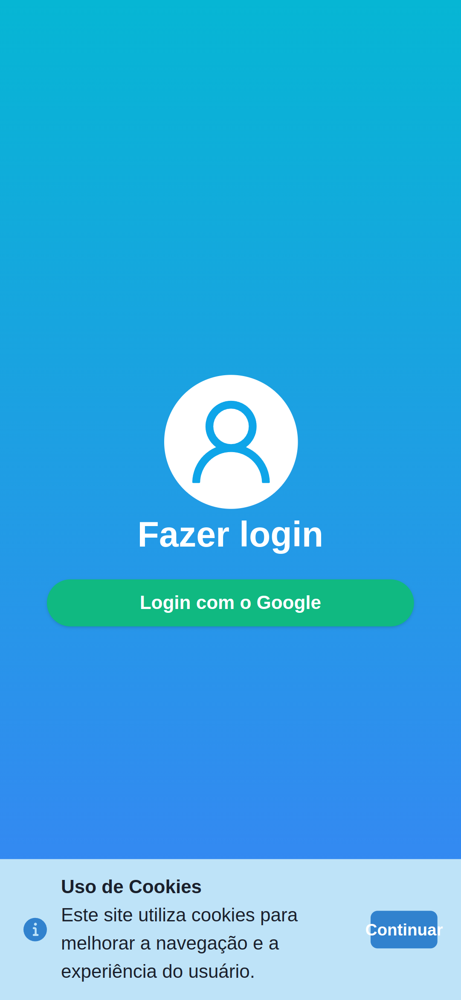
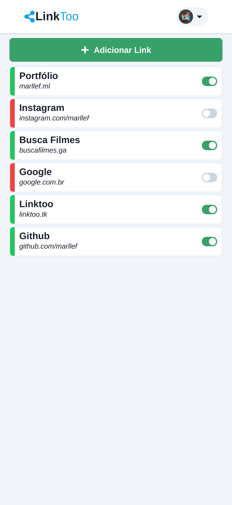
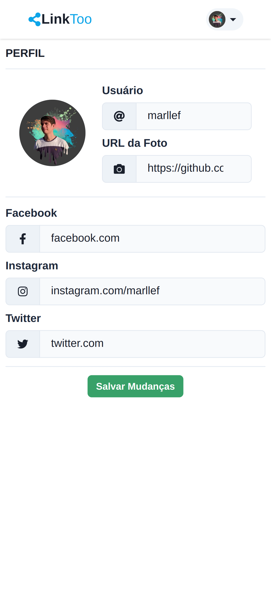
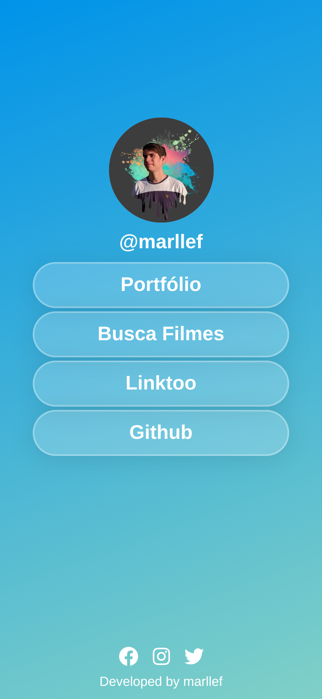

# LinkToo

<div align='center'>

Agregador de links simples para utilização em redes sociais.






_Telas internas do aplicativo_

</div>

## Informações

_Para executar este projeto localmente siga as etapas descritas neste documento._

### Pré-requisitos

Antes de iniciar é necessário ter o yarn instalado.

```sh
npm install -g yarn@latest
```

Além disso, faz-se necessário ter um projeto configurado no [Firebase](https://console.firebase.google.com/).

## Instalação

_Siga o passo-a-passo para instalar o projeto em sua máquina._

1. Clone o repositório:

```sh
   git clone https://github.com/marllefH/linktoo.git
```

2. Instale as dependências necessárias:

```sh
   yarn install
```

3. Adicione as variaveis de ambiente necessárias seguindo o exemplo do arquivo `.env.example`.

4. Gere os modelos do `Prisma Client` com o seguinte comando:

```sh
   yarn prisma generate
```

5. Execute o projeto.

```sh
   yarn dev
```

## Licença

Este projeto está sob licença MIT.

Copyright (c) 2022 [Marllef Hyorrane Alves De Freitas](http://github.com/marllef)
